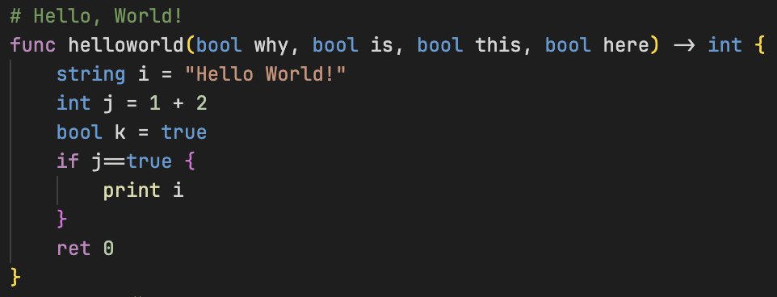
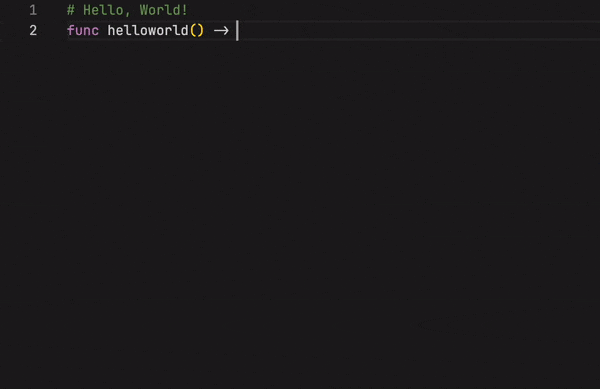
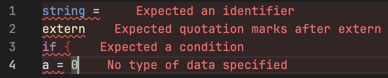

# vscode-rosemary

A simple Visual Studio Code extension for the programming language Rosemary, located [here](https://github.com/spartanproj/rosemary).

*Install me by clicking [here](https://marketplace.visualstudio.com/items?itemName=Rosemary.rosemary)!*

Works with `.rsmy` and `.rh` files.

## Features

### Support for the browser on [vscode.dev](https://vscode.dev)

Partial support is on the browser counterpart of VS Code. This includes:

- Syntax highlighting
- Partial IntelliSense in open files

*Don't always expect to get the latest features with the desktop release, however.*

### Syntax highlighting

This extension has simple syntax highlighting, with the following:

- Keywords, such as `if` and `while`
- Constants, such as `true` and `false`
- Commands, such as `print` and `input`

### IntelliSense (auto-complete)

- Brackets are automatically completed
- List of keywords and commands

### Linting

*(Errors shown using the [Error Lens](https://marketplace.visualstudio.com/items?itemName=usernamehw.errorlens) extension on VSC.)*

Basic linting with more to come.

Checks:

- `type =` without an identifier
- Commands such as `print` and `extern` without a value
- `if` or `elif` statement without condition
- `if` or `elif` statement without brackets
- Variables without types
- And much more...

### To come

- Semantic highlighting (variables)
- ~~Linting (error checking)~~ (partially implemented)
  - `return` outside of a function
  - `else` or `elif` without an `if` statement
- Debugging
- Embed C support in `extern ""`

## Extension Settings

To use Semantic highlighting in VSCode, turn it on in your Settings by searching `semantic` and turning Semantic Highlighting to `true`.

## Known Issues

- Sometimes IntelliSense is a bit slow to start, working on optimizing it as a low priority job
- If you see two of each keyword in the completion list, restart! I don't know why it happens
- > I can't see the highlighting!
  
  That's not my fault. Try a different theme (Dark+ is a good one) and go into your settings.
- > There is no highlighting on the variables/other stuff!
  
  Semantic highlighting has not been added yet and I don't want to do it using a regex.
  
  Please, please only make an issue if it's a Rosemary keyword/command that has not been added within a fortnight of being added. I have to juggle around my time too!

## Release Notes

### 1.0.0

#### New major update!

- Added linting.
- Also restructured the extension so that IntelliSense and linting are now inside a LSP.

### 0.1.0

Full browser support has been implemented. Try it out at [vscode.dev](https://vscode.dev).

### 0.0.3

Add experimental browser support at [vscode.dev](https://vscode.dev).

### 0.0.2

Fix a small mistake I made in `package.json`.

### 0.0.1

First release of the extension.
Features include basic IntelliSense and syntax highlighting. More to come!

**Enjoy!**
