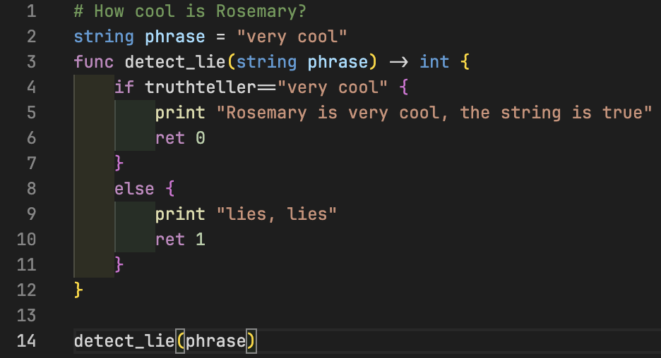

# vscode-rosemary

<!-- This is the README for your extension "rosemary". After writing up a brief description, we recommend including the following sections. -->
A simple VSC extension for the programming language Rosemary, located [here](https://github.com/spartanproj/rosemary).

## Features

<!-- Describe specific features of your extension including screenshots of your extension in action. Image paths are relative to this README file.

For example if there is an image subfolder under your extension project workspace:

\!\[feature X\]\(images/feature-x.png\)

> Tip: Many popular extensions utilize animations. This is an excellent way to show off your extension! We recommend short, focused animations that are easy to follow. -->

### Syntax highlighting

This extension has simple syntax highlighting, with the following:

- [x] Keywords, such as `if` and `while`
- [x] Constants, such as `true` and `false`
- [x] Commands, such as `print` and `input`

### IntelliSense (auto-complete)

- [x] Brackets are automatically completed
- [x] List of keywords and commands

### To come

- [ ] Semantic highlighting (variables)
- [ ] Error checking
- [ ] Debugging

## Extension Settings

<!-- Include if your extension adds any VS Code settings through the `contributes.configuration` extension point.

For example:

This extension contributes the following settings:

* `myExtension.enable`: Enable/disable this extension.
* `myExtension.thing`: Set to `blah` to do something. -->

To use Semantic highlighting in VSCode, turn it on in your Settings by searching `semantic` and turning Semantic Highlighting to `true`.

## Known Issues

- Sometimes IntelliSense is a bit slow to start, working on optimizing it as a low priority job
- > I can't see the highlighting!
  
  That's not my fault. Try a different theme (Dark+ is a good one) and go into your settings.
- > There is no highlighting on the variables/other stuff!
  
  Semantic highlighting has not been added yet and I don't want to do it using a regex.
  
  Please, please only make an issue if it's a Rosemary keyword/command that has not been added within a fortnight of being added. I have to juggle around my time too!

## Release Notes

<!-- Users appreciate release notes as you update your extension. -->

### 0.0.1
First release of the extension.
Features include basic IntelliSense and syntax highlighting. More to come!

**Enjoy!**
